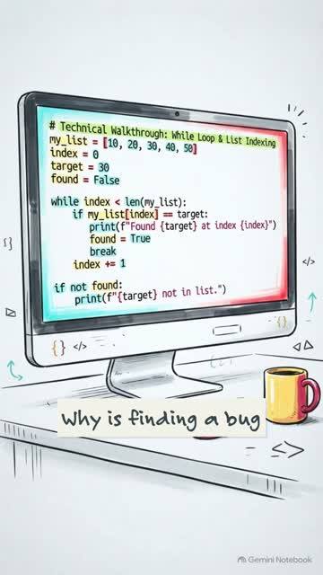
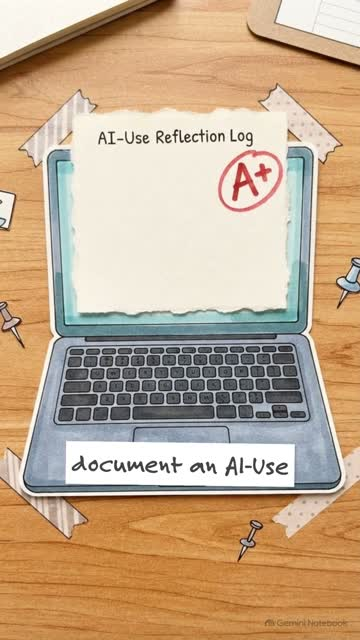

# CIS 110 · Introduction to Programming — Module 4

**Lists, Strings, and Iteration Patterns**: programs that handle collections, and
the three loops that cover most of what you will ever write: **accumulate,
search and filter**.


> **Lab 4 is Assistance Permitted with Disclosure, in a fixed order.**
> Write Parts A and B **yourself**. Once your version passes the self-check,
> save a copy as `lab4_working_version.ipynb`. **Only then** ask an AI assistant
> for **one** refactor, and judge it in Part C. Submissions where the assistant
> clearly wrote the initial implementation are returned ungraded for
> resubmission. See the [AI-Use Policy](welcome/06_ai_use_policy.md).

---

## What's in this folder

### Module 4
| File | |
|---|---|
| [Module overview](module4/module4_overview.md) | Objectives, readings (read out of order, on purpose), assessments |
| [`lab4_text_analyzer.ipynb`](lab4_text_analyzer.ipynb) | **The lab.** Work through it top to bottom. |
| [`ai_use_reflection_4.md`](ai_use_reflection_4.md) | AI-Use Reflection 4: fill in and submit |
| `check_my_work.py` | Self-check to run before you submit |
| [Videos and media](module4/videos_and_media.md) | *Refactoring with an AI Assistant* screencast, plus three one-minute explainers |
| [Worked refactor example](module4/refactor_worked_example/ai_suggestion.md) | The code from the video, and a model Part C |
| [Discussion 2: Which Data Structure, and Why](module4/discussion_2_which_data_structure.md) | The three scenarios |
| [Sync Session 2: Debugging Clinic](module4/sync_session_2_debugging_clinic.md) | Agenda and how to prepare |
| [Debugging Clinic submission form](module4/debugging_clinic_submission_form.md) | Due **48 hours before** the session |

### Short videos (about 1 minute each)
| | | |
|---|---|---|
| [](module4/videos/why_programmers_must_still_learn_to_write_code.mp4) | [](module4/videos/why_reading_ai_code_is_harder_than_writing_it.mp4) | [](module4/videos/how_to_write_an_ai_reflection_log.mp4) |
| Why Programmers Must Still Learn to Write Code | Why Reading AI Code Is Harder Than Writing It | How to Write an AI Reflection Log |

### Visual tools
| | |
|---|---|
| [**Iteration Pattern Visualizer**](module4/pattern_visualizer.html) | Open in your browser and step through a loop on your own list, watching every variable change |
| [The three patterns diagram](module4/iteration_patterns.svg) | Accumulate, search and filter in one picture |

### Course reference (same as the Welcome module)
| | |
|---|---|
| [Start here](welcome/01_start_here.md) · [Course overview](welcome/02_course_overview.md) | Checklist, objectives, schedule |
| [**AI-Use Policy**](welcome/06_ai_use_policy.md) · [Academic integrity](welcome/07_academic_integrity.md) | The rules for AI use |
| [How to complete an AI-Use Reflection](welcome/08_how_to_complete_an_ai_use_reflection.md) | Guide, with a **Lab 4** worked example |
| [Getting help](welcome/09_getting_help.md) | Where to go when you are stuck |

### Setup
| | |
|---|---|
| [Setup guide](setup/SETUP_GUIDE.md) · [Troubleshooting](setup/TROUBLESHOOTING.md) | Including the optional chart and the working-version copy |
| `setup/verify_environment.py` | Checks your setup is ready |

---

## Step 1 — Open the lab

In VS Code, choose **File → Open Folder** and open this folder, then click
`lab4_text_analyzer.ipynb`. When asked to **Select Kernel**, choose your
Python 3.12. Run the **PROVIDED** cell first.

## Step 2 — Parts A and B: your own code

Each crimson heading teaches one idea with a worked example; each orange
**EXERCISE** is yours. Every exercise is a function, and each cell ends with
*Try it out* lines that show the answer you should get.

## Step 3 — Check your work, then save a copy

```
python check_my_work.py
```

It calls your functions with texts you have never seen, including ties, empty
text and words that are all punctuation, and gives a hint for anything not
working yet. It is a **self-check, not your grade.**

When Exercises 5–10 pass, **File → Save As… `lab4_working_version.ipynb`**.

## Step 4 — Part C: evaluate one AI refactor

Follow the steps in the notebook. Rejecting a suggestion with sound reasoning
earns full credit.

## Step 5 — Submit on Canvas

1. `lab4_text_analyzer.ipynb`
2. `lab4_working_version.ipynb`
3. `ai_use_reflection_4.md`

Restart the notebook and **Run All** before you upload.

---

## How Lab 4 is graded — 35 points

| Part | Exercise | Points | Graded by |
|---|---|---|---|
| A | 1 · List workout | 2 | Self-check |
| A | 2 · Clean and build text | 3 | Self-check |
| A | 3 · One of each pattern | 3 | Self-check |
| A | 4 · Name that pattern | 2 | Self-check |
| B | 5 · Get the words | 2 | Self-check |
| B | 6 · Count and average | 2 | Self-check |
| B | 7 · Top ten words | 3 | Self-check |
| B | 8 · Longest sentence | 2 | Self-check |
| B | 9 · Text bar chart | 1 | Self-check |
| B | 10 · The full report | must run | Self-check |
| C | 11 · Evaluate an AI refactor | 15 | Instructor |

The AI-Use Reflection (15) and Discussion 2 (20) are graded separately.
