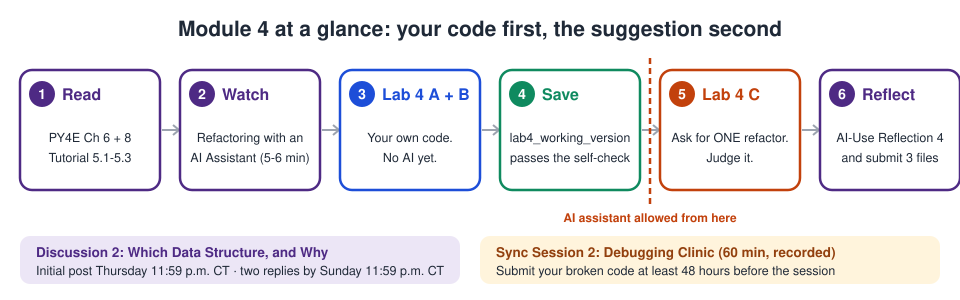

# Module 4: Lists, Strings, and Iteration Patterns

## Module overview

Programs become interesting when they handle collections of things rather than
single values. This module introduces **lists** and works seriously with
**strings**, and it teaches the three iteration patterns that cover most of what
you will ever write: **accumulate, search, and filter**. Recognizing which pattern
a problem needs is a large part of what experienced programmers are doing when
they seem to know what to write immediately.

This is also the **first module in which an AI assistant may suggest code to
you**, but only as a proposed refactor of code **you wrote first**, which you
must then judge.

## Module objectives

By the end of this module, you will be able to:

1. Create, index, slice, and modify lists, and select appropriate list operations
   for a task.
2. Apply common string methods to parse and construct text.
3. Implement the accumulate, search, and filter iteration patterns, and identify
   which one a problem requires.
4. Evaluate an AI-suggested refactor of your own code and justify accepting or
   rejecting it on grounds of correctness and readability.

## Assessments this module

| Assessment | Points | AI permission level | Due |
|---|---|---|---|
| [Lab 4: Text Analyzer](../lab4_text_analyzer.ipynb) | 35 | **Assistance Permitted with Disclosure** | [TO CONFIRM on Canvas] |
| [AI-Use Reflection 4](../ai_use_reflection_4.md) | 15 | — | with Lab 4 |
| [Discussion 2: Which Data Structure, and Why](discussion_2_which_data_structure.md) | 20 | — | Thursday / Sunday, 11:59 p.m. CT |

**The sequence matters in Lab 4.** Write and test your own working version first,
save a copy, and only then ask an assistant for one refactor. Submissions where
the assistant clearly wrote the initial implementation are returned ungraded
for resubmission.

## Readings and resources

> **You are reading out of the textbook's order, on purpose.** *Python for
> Everybody* goes Strings (Ch. 6) → Files (Ch. 7) → Lists (Ch. 8) →
> Dictionaries (Ch. 9). This course needs lists early so it can teach the
> iteration patterns with them, so this week you read **Chapters 6 and 8** and
> **skip Chapter 7**. Files come in Module 6, and dictionaries in Module 5. You
> have not missed anything.

**Required**

- **Severance, *Python for Everybody*, Chapter 6: Strings**
  ([py4e.com/html3/06-strings](https://www.py4e.com/html3/06-strings)).
  Indexing, slicing, `in`, and string methods such as `lower`, `strip`, `split`
  and `startswith`, which is everything `clean_word` and `get_words` need.
- **Severance, *Python for Everybody*, Chapter 8: Lists**
  ([py4e.com/html3/08-lists](https://www.py4e.com/html3/08-lists)).
  Lists are mutable, list methods, lists and strings together (`split` and
  `join`), and the aliasing trap from the lab.
- **Python Software Foundation, *The Python Tutorial*, sections 5.1–5.3**
  ([docs.python.org/3/tutorial/datastructures.html](https://docs.python.org/3/tutorial/datastructures.html)).
  5.1 *More on Lists* is the official reference for every list method; 5.2 *The
  `del` statement*; 5.3 *Tuples and Sequences*. Subsections 5.1.1–5.1.4 (stacks,
  queues, list comprehensions) are for familiarity only: you will not need them
  for the lab.

**Optional**

- **Real Python, "Python's list Data Type: A Deep Dive With Examples"**
  ([realpython.com/python-list](https://realpython.com/python-list/)).
- **Real Python, "Strings and Character Data in Python"**
  ([realpython.com/python-strings](https://realpython.com/python-strings/)),
  including its section on built-in string methods.

Use the optional readings if the textbook's approach is not clicking. They cover
the same ideas with many more small examples.

## Visual tools for this module

| Tool | What it shows you |
|---|---|
| [Iteration Pattern Visualizer](pattern_visualizer.html) | Open it in your browser (it works offline). Step through accumulate, search, filter and *count with two lists* on **your own** list, and watch every variable change. |
| [The three patterns, in one picture](iteration_patterns.svg) | The diagram used in the lab |
| [Python Tutor](https://pythontutor.com/python-compiler.html#mode=edit) | Paste any short program and watch the lists as arrows and boxes. Useful for seeing two names point at one list. |
| Your own bar chart | Exercise 9 of the lab draws one in plain text, and an optional cell redraws it with matplotlib. |

## This module's video

See [Videos and media](videos_and_media.md): **Refactoring with an AI Assistant:
A Worked Example** (5–6 min). The code from the video is in
[`refactor_worked_example/`](refactor_worked_example/ai_suggestion.md).

## Live session

**[Sync Session 2: Debugging Clinic](sync_session_2_debugging_clinic.md)**:
60 minutes, recorded. Bring real broken code from Lab 4, and submit it at least
**48 hours before** the session using the
[submission form](debugging_clinic_submission_form.md).
